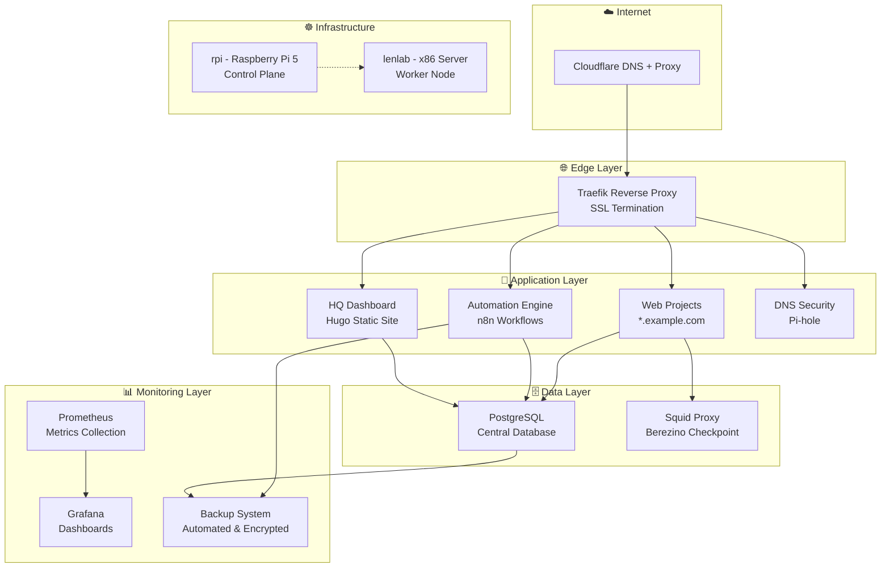

# 🌟 Surviving Chernarus

<div align="center">


**Plataforma de infraestructura híbrida con automatización completa, SSL automático, monitoreo avanzado y deployment simplificado**

[📖 Documentación](#-documentación) • [🚀 Inicio Rápido](#-inicio-rápido) • [⚙️ Configuración](#️-configuración) • [🤝 Contribuir](#-contribuir)

</div>

---

## 🎯 ¿Qué es Surviving Chernarus?

Surviving Chernarus es una plataforma de infraestructura moderna que combina lo mejor de Docker Compose y Kubernetes para crear un entorno de hosting completo, automatizado y escalable. Diseñada para desarrolladores que buscan una solución integral para desplegar y gestionar aplicaciones web con mínimo esfuerzo y máxima confiabilidad.

### ✨ Características Principales

🔒 **SSL Automático**: Certificados Let's Encrypt con renovación automática vía Cloudflare
🌐 **Reverse Proxy Inteligente**: Traefik v2 con configuración dinámica
📡 **Multi-Proyecto**: Hosting simultáneo de múltiples sitios web
🤖 **Automatización Total**: Workflows n8n + GitHub Actions + scripts personalizados
📊 **Monitoreo Avanzado**: Stack Prometheus + Grafana con alertas automáticas
💾 **Backups Automáticos**: Sistema de backup cifrado y programado
🐳 **Containerización**: Soporte completo Docker Compose + Kubernetes
🍓 **Cluster Híbrido**: Raspberry Pi 5 + servidor x86 en clúster Kubernetes
🧠 **AI-Optimized**: Workspace configurado para GitHub Copilot y agentes de IA

---

## 🏗️ Arquitectura del Sistema

<div align="center">



</div>

### 🌐 Topología de Red

- **Master Node (rpi)**: Raspberry Pi 5 - Control plane, servicios de red (192.168.0.2)
- **Worker Node (lenlab)**: Servidor x86 - Cargas pesadas, bases de datos (192.168.0.3)
- **Networking**: Flannel CNI para comunicación pod-to-pod
- **Load Balancing**: Traefik con detección automática de servicios

---

## 🚀 Inicio Rápido

### 📋 Prerrequisitos

- **Docker & Docker Compose**: v20.10+
- **Git**: Para clonar el repositorio
- **Bash**: Scripts de automatización
- **Opcional**: Kubernetes cluster para deployment avanzado

### ⚡ Despliegue en 5 Minutos

```bash
# 1. Clonar el repositorio
git clone https://github.com/terrerovgh/surviving-chernarus.git
cd surviving-chernarus

# 2. Configurar entorno
cp .env.example .env
# Editar .env con tus valores

# 3. Procesar configuraciones
./scripts/process-configs.sh

# 4. Levantar la infraestructura
docker-compose up -d

# 5. Verificar estado
docker-compose ps
```

### 🎯 Acceder a los Servicios

Una vez desplegado, accede a:

- 🌐 **Traefik Dashboard**: http://localhost:8080
- 🤖 **n8n Automation**: http://localhost:5678
- 📊 **Grafana Monitoring**: http://localhost:3000
- 🛡️ **Pi-hole Admin**: http://localhost/admin
- 🗄️ **PostgreSQL**: localhost:5432

---

## ☸️ Despliegue Kubernetes

### 🏗️ Configuración del Cluster

```bash
# Configurar master node (Raspberry Pi)
./scripts/k8s-setup-master.sh

# Obtener comando de join
sudo kubeadm token create --print-join-command

# Agregar worker node
./scripts/k8s-setup-worker.sh <token> <hash>

# Verificar cluster
./scripts/cluster-status.sh
```

### 📊 Estado del Cluster

```bash
kubectl get nodes -o wide
# NAME     STATUS   ROLES           AGE   VERSION   INTERNAL-IP
# rpi      Ready    control-plane   1h    v1.33.2   192.168.0.2
# lenlab   Ready    <none>          45m   v1.33.2   192.168.0.3
```

---

## ⚙️ Configuración

### 🔧 Variables de Entorno

Copia `.env.example` a `.env` y configura:

```bash
# === Configuración Principal ===
DOMAIN=tu-dominio.com
EMAIL=tu-email@dominio.com

# === Base de Datos ===
POSTGRES_DB=chernarus_db
POSTGRES_USER=chernarus_user
POSTGRES_PASSWORD=tu_password_seguro

# === Cloudflare ===
CLOUDFLARE_EMAIL=tu-email@cloudflare.com
CLOUDFLARE_API_TOKEN=tu_api_token

# === Monitoreo ===
GRAFANA_ADMIN_PASSWORD=admin_password
TELEGRAM_BOT_TOKEN=bot_token_opcional
```

### 📁 Estructura del Proyecto

```
surviving-chernarus/
├── 📄 docker-compose.yml          # Stack principal de servicios
├── 📄 docker-compose-debug.yml    # Stack de desarrollo
├── 📁 services/                   # Configuraciones de servicios
│   ├── 📁 traefik/               # Reverse proxy config
│   ├── 📁 pihole/                # DNS security config
│   ├── 📁 hugo_site/             # Dashboard estático
│   └── 📁 squid/                 # Proxy configuration
├── 📁 kubernetes/                 # Manifests de Kubernetes
│   ├── 📁 core/                  # Servicios core
│   └── 📁 apps/                  # Aplicaciones
├── 📁 scripts/                    # Scripts de automatización
├── 📁 docs/                       # Documentación completa
├── 📁 .vscode/                    # Configuración VS Code
└── 📁 .github/                    # CI/CD workflows
```

---

## 🛠️ Desarrollo y Workspace

### 💻 VS Code Optimizado

El proyecto incluye configuración completa para desarrollo con VS Code:

- ⚙️ **Settings.json**: Configuración optimizada para infraestructura
- 🧩 **Extensions**: Recomendaciones automáticas (Docker, Kubernetes, YAML)
- 🏃 **Tasks**: Tareas predefinidas para deploy, testing, monitoreo
- 🐛 **Debugging**: Configuración para shell, Python, Docker
- ✂️ **Snippets**: Templates para Docker Compose, Kubernetes, scripts

```bash
# Abrir workspace optimizado
code surviving-chernarus.code-workspace
```

### 🤖 GitHub Copilot Ready

Configuración específica para maximizar la efectividad de GitHub Copilot:

- 📝 Asociaciones de archivos optimizadas
- 🎯 Contexto rico del proyecto en documentación
- 🔧 Snippets específicos de la infraestructura
- 📊 Schemas YAML para mejor autocompletado

### 🚀 Tareas Disponibles

Ejecuta `Ctrl+Shift+P` → "Tasks: Run Task":

- **🚀 Deploy Chernarus Services**: Despliegue completo
- **📊 Chernarus Health Check**: Verificación de estado
- **🏗️ Setup Kubernetes Master**: Configuración de K8s
- **💾 Full Chernarus Backup**: Backup completo
- **🔍 Diagnose Network Issues**: Diagnósticos de red

---

## 📊 Monitoreo y Observabilidad

### 📈 Stack de Monitoreo

- **Prometheus**: Recolección de métricas
- **Grafana**: Dashboards y visualización
- **AlertManager**: Gestión de alertas
- **n8n**: Automatización de respuestas

### 🚨 Alertas Automáticas

- 📧 Email notifications
- 📱 Telegram alerts
- 🔄 Auto-healing workflows
- 📊 Performance monitoring

### 🔍 Health Checks

```bash
# Verificar estado completo
./scripts/health-check.sh

# Monitorear servicios
./scripts/monitor-services.sh

# Diagnósticos de red
./scripts/diagnose-traefik.sh
```

---

## 💾 Backup y Recuperación

### 🔄 Backup Automático

```bash
# Backup completo manual
./scripts/backup-chernarus.sh

# Programar backups automáticos
crontab -e
# 0 2 * * * /path/to/surviving-chernarus/scripts/backup-chernarus.sh
```

### 📦 Contenido del Backup

- 🗄️ Volúmenes de Docker
- ☸️ Configuraciones de Kubernetes
- ⚙️ Archivos de configuración
- 📝 Workflows de n8n
- 🔑 Certificados SSL

### 🔄 Restauración

```bash
# Restaurar desde backup
./scripts/restore-chernarus.sh backup_20250708_120000.tar.gz
```

---

## 🔒 Seguridad

### 🛡️ Características de Seguridad

- **SSL/TLS**: Certificados automáticos Let's Encrypt
- **DNS Security**: Pi-hole para bloqueo de dominios maliciosos
- **Network Isolation**: Redes Docker segregadas
- **Secret Management**: Gestión segura de credenciales
- **Firewall**: Configuración restrictiva por defecto
- **Updates**: Actualizaciones automáticas de seguridad

### 🔐 Best Practices

- 🔑 Todas las credenciales en `.env`
- 🌐 SSL en todos los servicios públicos
- 🔄 Backups cifrados automáticos
- 📊 Monitoreo de eventos de seguridad
- 🚫 Acceso restringido por IP cuando sea posible

---

## 📖 Documentación

### 📚 Documentos Principales

- 📄 **[Configuración del Workspace](docs/workspace-configuration.md)**: VS Code, Copilot, desarrollo
- 📄 **[Setup de Kubernetes](docs/kubernetes-cluster-setup.md)**: Configuración completa del cluster
- 📄 **[Arquitectura del Proyecto](docs/architecture.md)**: Diseño y topología
- 📄 **[Reglas del Proyecto](docs/project_rules.md)**: Directrices y estándares
- 📄 **[Reglas de Usuario](docs/user_rules.md)**: Configuración para Copilot

### 🔗 Enlaces Útiles

- 🐳 [Docker Compose Reference](https://docs.docker.com/compose/)
- ☸️ [Kubernetes Documentation](https://kubernetes.io/docs/)
- 🌐 [Traefik Documentation](https://doc.traefik.io/traefik/)
- 🤖 [n8n Documentation](https://docs.n8n.io/)

---

## 🧪 Testing y CI/CD

### 🔄 Pipeline Automático

GitHub Actions configurado para:

- ✅ **Linting**: ShellCheck, YAML validation
- 🧪 **Testing**: Docker Compose testing
- 🔒 **Security**: Container scanning
- 🚀 **Deploy**: Automated deployment
- 📊 **Monitoring**: Health checks automáticos

### 🏃 Ejecutar Tests

```bash
# Tests locales
./scripts/test-compose.sh

# Validar configuraciones
./scripts/validate-configs.sh

# Test de conectividad
./scripts/test-network.sh
```

---

## 🚨 Troubleshooting

### 🔍 Problemas Comunes

#### Docker no inicia servicios
```bash
# Verificar logs
docker-compose logs

# Reiniciar servicios
docker-compose restart

# Rebuild si es necesario
docker-compose up -d --build
```

#### Problemas de red Kubernetes
```bash
# Verificar nodos
kubectl get nodes

# Verificar pods
kubectl get pods -A

# Reiniciar networking
sudo systemctl restart kubelet
```

#### Problemas de SSL
```bash
# Verificar Traefik
curl -s http://localhost:8080/api/rawdata | jq '.routers'

# Renovar certificados
docker-compose restart traefik
```

### 📞 Obtener Ayuda

1. 📖 Revisar la documentación en `docs/`
2. 🔍 Buscar en issues existentes
3. 🆕 Crear un nuevo issue con template
4. 💬 Discutir en Discussions

---

## 🤝 Contribuir

### 🌟 Contribuciones Bienvenidas

- 🐛 **Bug reports**: Usa el template de issue
- ✨ **Features**: Propón nuevas funcionalidades
- 📝 **Documentación**: Mejora la documentación
- 🧪 **Testing**: Añade más tests
- 🎨 **UI/UX**: Mejora dashboards y interfaces

### 🔄 Proceso de Contribución

1. 🍴 Fork el repositorio
2. 🌱 Crea una feature branch (`git checkout -b feature/amazing-feature`)
3. 💝 Commit tus cambios (`git commit -m 'Add amazing feature'`)
4. 📤 Push a la branch (`git push origin feature/amazing-feature`)
5. 🔄 Abre un Pull Request

### 📋 Guidelines

- Seguir las convenciones de código existentes
- Añadir tests para nuevas funcionalidades
- Actualizar documentación según sea necesario
- Usar commits descriptivos

---

## 📜 Licencia

Este proyecto está licenciado bajo la Licencia MIT - ver el archivo [LICENSE](LICENSE) para detalles.

---

## 🙏 Reconocimientos

- **Traefik**: Por el excelente reverse proxy
- **n8n**: Por la plataforma de automatización
- **Prometheus & Grafana**: Por el stack de monitoreo
- **Kubernetes**: Por la orquestación de containers
- **GitHub Copilot**: Por acelerar el desarrollo

---

## 📊 Estadísticas del Proyecto


---

<div align="center">

**⭐ Si este proyecto te ha sido útil, considera darle una estrella ⭐**

**Desarrollado con ❤️ por [Víctor Terrero](https://github.com/terrerovgh)**

**🏠 [example.com](https://example.com) • 📧 [admin@example.com](mailto:admin@example.com)**

</div>
